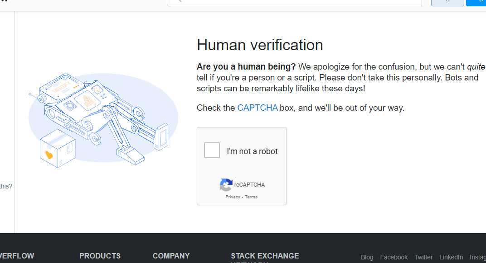

# Copying Youtube 'Watch Later' Playlist to an existing Youtube playlist

Youtube has a limit of 5000 videos per playlist. 
So, because I went on adding many vidoes to watch later, without clearing them (which is very important), I reached the 5000 mark. 

Had to write this script to transfer all my watch later vidoes to a new playlist I created 'Watch later - Old'. 

## Dependencies
- Selenium (Uses Chrome Driver)

## Usage
You need to log-in to google to access the playlists. 

We just need the following
```python
# Copying from Watch Later to
copyToPlaylist = 'Watch Later - Old'

# Google Log in Credentials
myUserNameOrEmail = 'YourEmail@gmail.com'
myPassword = 'YourPassword'
```

With selenium direct login to google is prevented use to some issues ("This browser or app may not be secure"). 

Work around? Login to google via Stackoverflow ([Google Login with Selenium: Solved](https://medium.com/@hostapandey/google-login-with-selenium-solved-f58873af5de9))

During this login, very rarely, you get to enter captcha on stackoverflow. 



## Problems
- One of the biggest problems with this approach? 
It's slow. Maybe there is a faster and simpler Youtube API approach. 

- Also, it cannot run in the background. Chrome Window must be open throughout. 
